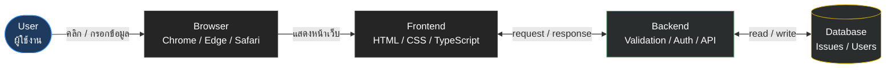
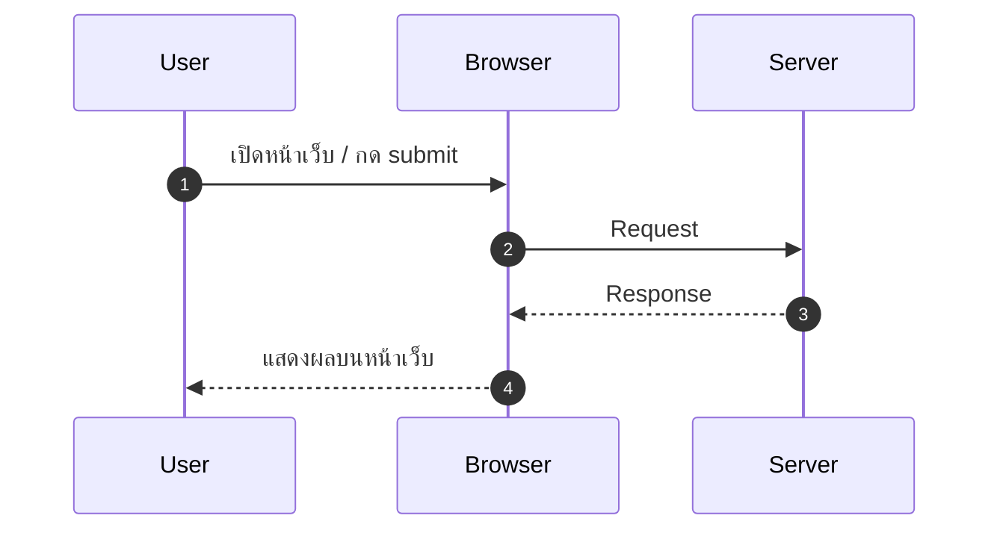
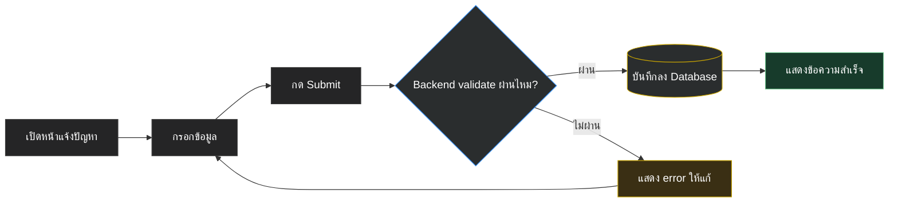
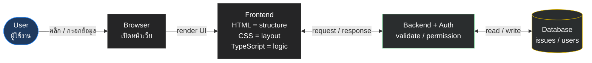
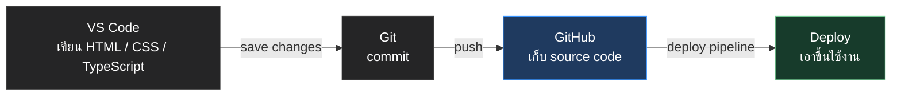

# Basic Website Workflow

## Day 1 - ชั่วโมงที่ 1: Basic Website Workflow

### เป้าหมายของชั่วโมงนี้

หลังจบชั่วโมงแรก ผู้เรียนควรสามารถ:

1. อธิบายได้ว่าเว็บไซต์หนึ่งระบบประกอบด้วย frontend, backend และ database
2. เข้าใจภาพรวม request/response ระหว่าง browser และ server
3. อธิบาย CRUD ได้ในภาษาง่าย ๆ
4. เห็นภาพว่า HTML, CSS, TypeScript, Next.js, database และ authentication อยู่ตรงไหนในระบบจริง
5. เข้าใจโจทย์โปรเจกต์หลักของ bootcamp คือระบบแจ้งปัญหาและติดตามงานภายในฝ่าย IT

### ไฟล์ที่เกี่ยวข้องในชั่วโมงนี้

ชั่วโมงนี้ยังไม่เริ่มเขียนไฟล์ code หลัก เป็นช่วงอธิบายภาพรวมและวาด flow

ไฟล์ที่จะเริ่มสร้างในชั่วโมงถัดไป:

```text
index.html
styles.css
README.md
```

---

## โครงสร้างเวลา 60 นาที

| เวลา | หัวข้อ | รูปแบบ |
|---|---|---|
| 0-5 นาที | เปิดคลาสและตั้งเป้าหมาย | พูดคุย |
| 5-15 นาที | เว็บไซต์คืออะไรในมุมระบบงานจริง | Explain + examples |
| 15-30 นาที | Frontend, Backend, Database | Diagram |
| 30-40 นาที | Request/Response flow | Diagram + live demo concept |
| 40-50 นาที | CRUD คืออะไร | Mapping กับระบบจริง |
| 50-60 นาที | วาด flow ตัวอย่างระบบแจ้งปัญหา | อธิบายพร้อมภาพ |

---

## Slide 1: Day 1 - From Web Page to Web Application

### Key Message

วันนี้เราจะไม่เริ่มจากการจำ tag หรือ syntax ทันที แต่จะเริ่มจากการเข้าใจว่าเว็บหนึ่งระบบทำงานอย่างไร

### Speaker Notes

ก่อนที่เราจะเขียน HTML, CSS หรือ TypeScript เราต้องเห็นภาพก่อนว่า code ที่เราเขียนจะไปอยู่ตรงไหนของระบบจริง เพราะงานของฝ่าย IT ไม่ได้มีแค่ทำหน้าเว็บให้สวย แต่ต้องเข้าใจว่า user ส่งข้อมูลอย่างไร ข้อมูลถูกบันทึกที่ไหน และ admin จะเข้ามาจัดการข้อมูลอย่างไร

### พูดกับผู้เรียน

> เป้าหมายของวันนี้คือทุกคนต้องเห็นภาพว่า จากหน้า form ง่าย ๆ จะกลายเป็น web application ที่มี database และระบบหลังบ้านได้อย่างไร

---

## Slide 2: Bootcamp นี้เราจะสร้างอะไร

### Project หลัก

**ระบบแจ้งปัญหาและติดตามงานภายในฝ่าย IT**

### ตัวอย่างผู้ใช้งาน

- นิสิตหรือเจ้าหน้าที่แจ้งปัญหา
- เจ้าหน้าที่ฝ่าย IT ตรวจสอบรายการปัญหา
- Admin เปลี่ยนสถานะงาน
- ผู้แจ้งติดตามผลการดำเนินงาน

### ตัวอย่างปัญหาที่แจ้งได้

- เข้าเว็บไซต์ไม่ได้
- ลืมรหัสผ่าน
- ระบบลงทะเบียนมีปัญหา
- ส่งแบบฟอร์มไม่ได้
- ข้อมูลในระบบไม่ถูกต้อง
- ต้องการขอสิทธิ์เข้าใช้งานระบบ

### Speaker Notes

ใช้โปรเจกต์นี้เป็นแกนกลางตลอด 5 วัน เพราะใกล้กับงานจริงของฝ่ายเทคโนโลยีสารสนเทศ และมีองค์ประกอบครบ ทั้งหน้าเว็บ form, รายการข้อมูล, database, login, admin และ security

---

## Slide 3: Day 1 อยู่ตรงไหนของทั้ง Bootcamp

### วันนี้เรายังไม่ทำระบบเต็ม

Day 1 จะสร้าง **static prototype** ก่อน:

```text
index.html
styles.css
```

Prototype นี้จะมี:

- หน้าแจ้งปัญหา
- form รับข้อมูล
- รายการปัญหาตัวอย่าง
- status badge
- layout ที่อ่านง่าย

### แล้วจะต่อยังไง

```text
Day 1: Static HTML/CSS prototype
Day 2: ย้าย prototype เข้า Next.js
Day 3: เพิ่ม frontend interaction และเตรียม CRUD flow
Day 4: เชื่อม database และทำ CRUD จริง
Day 5: เพิ่ม auth, security และ deployment overview
```

### Key Message

วันนี้เราไม่ได้ทำแค่หน้าเว็บเล่น ๆ แต่กำลังทำต้นแบบที่จะถูกย้ายเข้า Next.js และต่อยอดเป็นระบบจริงในวันถัดไป

---

## Slide 4: จาก Website ไปสู่ Web Application

### Website แบบง่าย

เว็บไซต์ที่เน้นแสดงข้อมูล เช่น:

- หน้าแนะนำหน่วยงาน
- หน้า contact
- หน้า announcement
- หน้าเอกสารประกาศ

### Web Application

เว็บไซต์ที่ผู้ใช้สามารถทำงานกับระบบได้ เช่น:

- กรอก form
- สมัครสมาชิก
- login
- ตรวจสอบสถานะ
- แก้ไขข้อมูล
- ดู dashboard

### Key Message

สิ่งที่เราจะเรียนไม่ใช่แค่การทำหน้าเว็บ แต่คือการทำระบบเว็บที่รับข้อมูล ประมวลผล และบันทึกข้อมูลได้

---

## Slide 5: ภาพรวมระบบเว็บหนึ่งระบบ



### อธิบายสั้น ๆ

- User คือผู้ใช้งานระบบ
- Browser คือโปรแกรมที่ใช้เปิดเว็บ เช่น Chrome, Edge, Safari
- Frontend คือส่วนที่ผู้ใช้เห็นและโต้ตอบได้
- Backend คือส่วนที่รับคำสั่ง ตรวจสอบ และประมวลผล
- Database คือที่เก็บข้อมูลของระบบ

### Speaker Notes

ให้เน้นว่าผู้ใช้ไม่ได้คุยกับ database โดยตรง ผู้ใช้คุยกับหน้าเว็บ หน้าเว็บส่งข้อมูลไป backend และ backend เป็นคนติดต่อ database

---

## Slide 6: Frontend คืออะไร

### Frontend คือส่วนที่ผู้ใช้เห็น

ตัวอย่าง:

- หน้า form แจ้งปัญหา
- ปุ่ม submit
- ตารางรายการปัญหา
- badge สถานะ เช่น OPEN, IN_PROGRESS, DONE
- หน้า login
- dashboard

### เทคโนโลยีที่เกี่ยวข้อง

- HTML ใช้กำหนดโครงสร้าง
- CSS ใช้กำหนดหน้าตา
- TypeScript ใช้เขียน logic ให้ปลอดภัยขึ้น
- Tailwind CSS ใช้ช่วยจัด style
- Next.js ใช้สร้าง web application

### ตัวอย่างในระบบแจ้งปัญหา

```text
ช่องกรอกชื่อเรื่องปัญหา
ช่องกรอกรายละเอียด
ปุ่มส่งข้อมูล
ตารางแสดงรายการปัญหา
```

---

## Slide 7: Backend คืออะไร

### Backend คือส่วนที่ทำงานหลังบ้าน

หน้าที่หลัก:

- รับข้อมูลจาก frontend
- ตรวจสอบว่าข้อมูลถูกต้องหรือไม่
- ตรวจสอบว่าผู้ใช้ login หรือยัง
- ตรวจสอบว่าผู้ใช้มีสิทธิ์ทำสิ่งนั้นหรือไม่
- บันทึกข้อมูลลง database
- ส่งผลลัพธ์กลับไปให้ frontend

### ตัวอย่างในระบบแจ้งปัญหา

เมื่อผู้ใช้กด submit:

```text
Backend ตรวจสอบว่า:
- title ไม่ว่าง
- email อยู่ในรูปแบบที่รับได้
- ผู้ใช้ login แล้วหรือไม่
- ข้อมูลยาวเกินไปหรือไม่
```

จากนั้น backend จึงบันทึกข้อมูลลง database

### Key Message

Backend คือจุดที่ต้องจริงจังกับ validation และ security มากที่สุด

---

## Slide 8: Database คืออะไร

### Database คือที่เก็บข้อมูลของระบบ

ตัวอย่างข้อมูลที่ต้องเก็บ:

- ข้อมูลผู้ใช้
- รายการปัญหา
- สถานะของปัญหา
- comment จาก admin
- วันเวลาที่สร้างรายการ
- ประวัติการแก้ไข

### ตัวอย่างตาราง Issue

| id | reporter | title | status | createdAt |
|---|---|---|---|---|
| 1 | Anan | Login ไม่ได้ | OPEN | 2026-05-03 |
| 2 | Mali | ส่งแบบฟอร์มไม่ได้ | IN_PROGRESS | 2026-05-03 |
| 3 | Kanda | ขอสิทธิ์ admin | DONE | 2026-05-03 |

### Speaker Notes

อธิบายว่า database ไม่ใช่ Excel ถึงแม้จะดูเหมือนตาราง แต่ database ถูกออกแบบมาให้ระบบค้นหา เพิ่ม แก้ไข ลบ และเชื่อมโยงข้อมูลได้อย่างเป็นระบบ

---

## Slide 9: Request และ Response

### เมื่อผู้ใช้เปิดหน้าเว็บ



### Request คืออะไร

คำขอที่ browser ส่งไปหา server เช่น:

- ขอเปิดหน้า `/issues`
- ขอส่ง form แจ้งปัญหา
- ขอแก้ไขสถานะปัญหา
- ขอ login

### Response คืออะไร

คำตอบที่ server ส่งกลับมา เช่น:

- HTML page
- JSON data
- success message
- error message
- redirect ไปหน้าอื่น

### Key Message

ทุกครั้งที่เราใช้เว็บ เรากำลังส่ง request และรับ response อยู่ตลอดเวลา

---

## Slide 10: Flow การแจ้งปัญหา 1 รายการ



### Speaker Notes

จุดสำคัญคือขั้นตอนที่ 6 เพราะหลายครั้งผู้เริ่มต้นคิดว่า validate ที่หน้าเว็บพอแล้ว แต่ในระบบจริง backend ต้อง validate ซ้ำเสมอ

---

## Slide 11: CRUD คืออะไร

CRUD คือ action พื้นฐานของระบบที่จัดการข้อมูล

| ตัวอักษร | ความหมาย | ตัวอย่างในระบบแจ้งปัญหา |
|---|---|---|
| C | Create | สร้างรายการแจ้งปัญหา |
| R | Read | ดูรายการปัญหา |
| U | Update | แก้ไขสถานะหรือเพิ่ม comment |
| D | Delete | ลบหรือปิดรายการ |

### Key Message

ระบบส่วนใหญ่ของฝ่าย IT คือ CRUD system ที่มี business rule และ security ครอบอยู่

---

## Slide 12: CRUD Mapping กับระบบจริง

### ระบบลงทะเบียนสอบแข่งขัน

- Create: สมัครสอบ
- Read: ตรวจสอบข้อมูลผู้สมัคร
- Update: แก้ไขข้อมูลหรือสถานะการชำระเงิน
- Delete: ยกเลิกใบสมัคร

### ระบบแจ้งปัญหา

- Create: แจ้งปัญหาใหม่
- Read: ดูรายการปัญหา
- Update: เปลี่ยนสถานะงาน
- Delete: ลบรายการที่สร้างผิด

### ระบบจัดการผู้ใช้

- Create: เพิ่ม user
- Read: ดูรายชื่อ user
- Update: แก้ไข role หรือข้อมูล user
- Delete: ปิดบัญชีผู้ใช้

---

## Slide 13: HTML, CSS, TypeScript อยู่ตรงไหนใน Flow

### Runtime Flow: ตอนผู้ใช้ใช้งานระบบ



### Development Workflow: ตอนเราพัฒนาและส่งงาน



### ตัวอย่าง

หน้า form แจ้งปัญหา:

- HTML สร้าง input และ button
- CSS ทำให้ form อ่านง่ายและ responsive
- TypeScript ตรวจชนิดข้อมูลของ issue
- Next.js ช่วยจัด frontend และ backend ให้อยู่ในโปรเจกต์เดียว
- Auth อยู่ใน backend flow เพื่อเช็ก login และ permission
- Database เก็บ issue ตอนระบบทำงานจริง
- GitHub อยู่ใน development workflow ไม่ใช่ส่วนที่ user ใช้งานโดยตรง

---

## Slide 14: ทำไมต้องเข้าใจ Flow ก่อนใช้ LLM

### ปัญหาที่พบบ่อย

ผู้เรียนหรือผู้พัฒนาใช้ LLM generate code ได้ แต่ไม่เข้าใจว่า:

- login flow ทำงานอย่างไร
- API endpoint ไหนต้อง protect
- ข้อมูลถูกบันทึกที่ไหน
- user คนไหนมีสิทธิ์แก้ไขอะไร
- code ที่ได้ปลอดภัยหรือไม่

### Key Message

LLM ช่วยเขียน code ได้เร็วขึ้น แต่คนเขียนต้องเข้าใจ flow เพื่อรู้ว่า code นั้นถูกต้องและปลอดภัยหรือไม่

### ตัวอย่างคำถามที่ดีต่อ LLM

```text
ช่วยอธิบาย flow ของระบบนี้ก่อนเขียน code
```

```text
endpoint นี้ควรตรวจสอบ permission ตรงไหนบ้าง
```

---

## Slide 15: Flow ตัวอย่างระบบแจ้งปัญหา

### วิธีสอน

ผู้สอนวาด flow จากโจทย์นี้บนสไลด์หรือกระดาน แล้วชวนถามทีละจุด:

```text
นิสิตแจ้งว่า login เข้าระบบไม่ได้
```

ให้ระบุว่า:

- User ทำอะไร
- Browser ส่งอะไร
- Frontend แสดงอะไร
- Backend ตรวจสอบอะไร
- Database เก็บอะไร
- Admin เห็นอะไร

### ผลลัพธ์

flow สุดท้ายควรได้ประมาณนี้:

```text
User -> Open issue form -> Submit issue -> Backend validates -> Save to database -> Admin sees new issue -> Admin updates status
```

---

## Slide 16: คำถามชวนคิดหลังดู Flow

### ถามผู้เรียน

1. ถ้า user ไม่กรอก title ระบบควรตรวจที่ frontend หรือ backend
2. ถ้า user ไม่ได้ login แต่พยายามแจ้งปัญหา ระบบควรทำอย่างไร
3. ถ้า user ธรรมดาพยายามเปลี่ยน status เอง ควรอนุญาตหรือไม่
4. ถ้า database ล่ม หน้าเว็บควรแสดงอะไร
5. ถ้า LLM สร้าง endpoint มาให้ แต่ไม่ได้เช็ก permission เราควรแก้ตรงไหน

### Key Message

คำถามเหล่านี้คือ mindset ของคนที่ไม่ได้แค่เขียนหน้าเว็บ แต่กำลังเริ่มคิดแบบ web application developer

---

## Slide 17: Recap ชั่วโมงแรก

### สิ่งที่ได้เรียน

- Website กับ web application ต่างกันอย่างไร
- Day 1 คือ static prototype ที่จะย้ายเข้า Next.js ใน Day 2
- Frontend, backend และ database ทำหน้าที่อะไร
- Request/response คืออะไร
- CRUD คืออะไร
- HTML, CSS และ TypeScript อยู่ตรงไหนของระบบ
- ทำไมต้องเข้าใจ flow ก่อนใช้ LLM เขียน code

### ต่อไปในชั่วโมงที่ 2

เราจะเริ่มลงมือสร้างหน้าเว็บแรกด้วย HTML โดยใช้โจทย์ระบบแจ้งปัญหา IT เป็นตัวอย่าง

---


---

## คำศัพท์สำคัญ

| คำศัพท์ | ความหมาย |
|---|---|
| Frontend | ส่วนที่ผู้ใช้เห็นและโต้ตอบด้วย |
| Backend | ส่วนหลังบ้านที่ประมวลผลและติดต่อ database |
| Database | ที่เก็บข้อมูลของระบบ |
| Request | คำขอที่ browser ส่งไปหา server |
| Response | คำตอบที่ server ส่งกลับมา |
| CRUD | Create, Read, Update, Delete |
| Authentication | การตรวจสอบตัวตน |
| Authorization | การตรวจสอบสิทธิ์ |
| Validation | การตรวจสอบความถูกต้องของข้อมูล |
