# CSS Foundation

Day 1 - ชั่วโมงที่ 3: CSS Foundation and Responsive Form Layout

### เป้าหมายของชั่วโมงนี้

หลังจบชั่วโมงที่สาม ผู้เรียนควรสามารถ:

1. เข้าใจว่า CSS ทำหน้าที่อะไรในหน้าเว็บ
2. ใช้ selector พื้นฐานเพื่อเลือก element ที่ต้องการตกแต่งได้
3. เข้าใจ box model ได้แก่ content, padding, border และ margin
4. จัด layout หน้าเว็บด้วย Flexbox หรือ Grid ในระดับพื้นฐานได้
5. ตกแต่ง form ให้ใช้งานง่ายและอ่านง่ายขึ้น
6. ทำ responsive layout เบื้องต้นสำหรับ mobile และ desktop ได้
7. เข้าใจ state สำคัญของ UI เช่น hover, focus และ disabled

### ไฟล์ที่ใช้ในชั่วโมงนี้

CSS ทั้งหมดใส่ใน:

```text
styles.css
```

HTML ที่ต้องเพิ่ม class เช่น `form-group` หรือ `form-row` อยู่ใน:

```text
index.html
```

ถ้า slide เป็น CSS ให้ระบุ:

```text
File: styles.css
```

---

  โครงสร้างเวลา 60 นาที

| เวลา | หัวข้อ | รูปแบบ |
|---|---|---|
| 0-5 นาที | Recap HTML จากชั่วโมงที่สอง | ถามตอบ |
| 5-15 นาที | CSS คืออะไร และเชื่อมกับ HTML อย่างไร | Explain + demo |
| 15-25 นาที | Selector และ cascade | Live coding |
| 25-35 นาที | Box model และ spacing | Visual explanation |
| 35-45 นาที | Form styling และ UI states | Live coding |
| 45-55 นาที | Responsive layout | Live coding |
| 55-60 นาที | สรุปสิ่งที่ทำ | ทำทีละขั้นตอน |

---

## Slide 1: Recap จากชั่วโมงที่สอง

### คำถามทบทวน

1. HTML ทำหน้าที่อะไร
2. Semantic HTML คืออะไร
3. ทำไม input ควรมี label
4. `id` กับ `name` ต่างกันอย่างไร
5. Form เกี่ยวข้องกับ web application อย่างไร

### Key Message

ชั่วโมงที่แล้วเราได้โครงสร้างของหน้าแจ้งปัญหาแล้ว ชั่วโมงนี้เราจะทำให้หน้าเว็บอ่านง่าย ใช้งานง่าย และรองรับหลายขนาดหน้าจอ

---

## Slide 2: CSS คืออะไร

### CSS ย่อมาจาก

**Cascading Style Sheets**

### CSS ทำหน้าที่อะไร

CSS ใช้กำหนดหน้าตาและการจัดวางของ HTML เช่น:

- สี
- ขนาดตัวอักษร
- ระยะห่าง
- เส้นขอบ
- layout
- responsive design
- hover และ focus state

### Key Message

HTML บอกว่าแต่ละส่วนคืออะไร ส่วน CSS บอกว่าแต่ละส่วนควรแสดงผลอย่างไร

---

## Slide 3: CSS ต่อเติมจาก HTML อย่างไร

```mermaid
flowchart LR
  html["HTML จากชั่วโมงที่แล้ว<br/>form / label / input / button"]
  selector["CSS Selector<br/>เลือก element หรือ class"]
  rule["CSS Rule<br/>สี / spacing / border / layout"]
  ui["Styled Form<br/>อ่านง่าย ใช้งานง่าย responsive"]
  ts["TypeScript ภายหลัง<br/>logic / data / validation"]

  html -->|"มีโครงสร้างแล้ว"| selector
  selector -->|"เลือกส่วนที่จะตกแต่ง"| rule
  rule -->|"ปรับประสบการณ์ใช้งาน"| ui
  ui -->|"ต่อยอดเรื่องข้อมูล"| ts

  classDef markup fill:#1f3a5f,stroke:#3794ff,color:#ffffff;
  classDef selectorNode fill:#252526,stroke:#3c3c3c,color:#ffffff;
  classDef visual fill:#3a2f14,stroke:#cca700,color:#ffffff;
  classDef result fill:#173b2b,stroke:#73c991,color:#ffffff;
  classDef future fill:#2a2d2e,stroke:#858585,color:#d4d4d4;

  class html markup;
  class selector selectorNode;
  class rule visual;
  class ui result;
  class ts future;
```



### ตัวอย่างระบบแจ้งปัญหา IT

- HTML จาก Hour 2 สร้าง form และตั้งชื่อ field ไว้แล้ว
- CSS ในชั่วโมงนี้เลือก tag หรือ class เช่น `form-group`, `form-row`, `button`
- CSS ทำให้ form เป็นระเบียบ อ่านง่าย และรองรับหน้าจอมือถือ
- TypeScript ยังไม่ใช่หัวข้อหลักของชั่วโมงนี้ แต่จะมาต่อเรื่องข้อมูลและ logic ภายหลัง

### Key Message

CSS ไม่ได้แทนที่ HTML แต่ใช้ HTML เป็นเป้าหมายในการจัดหน้าตาและประสบการณ์ใช้งาน

### Speaker Notes

เน้นว่าหน้าเว็บที่มี HTML ถูกต้องแต่ไม่มี CSS อาจใช้งานได้ แต่ประสบการณ์ผู้ใช้อาจไม่ดี โดยเฉพาะระบบที่ต้องให้เจ้าหน้าที่ใช้งานซ้ำทุกวัน ชี้ให้ผู้เรียนเห็นว่า `class` ที่เราใส่ไว้ใน HTML ชั่วโมงก่อนคือจุดเชื่อมระหว่าง HTML กับ CSS

---

## Slide 4: วิธีเชื่อม CSS กับ HTML

### วิธีที่แนะนำสำหรับวันนี้

สร้างไฟล์ `styles.css` แล้วเชื่อมใน `<head>`

### File

```text
index.html
```

### ตำแหน่งที่วาง

วาง `<link>` นี้ใน `<head>` ต่อจาก `<title>` หรือก่อน `</head>`

```html
<link rel="stylesheet" href="styles.css" />
```

### ตัวอย่างโครงไฟล์

```text
project/
  index.html
  styles.css
```

### ตัวอย่าง CSS แรก

### File

```text
styles.css
```

### ตำแหน่งที่วาง

สร้างไฟล์ `styles.css` ไว้ระดับเดียวกับ `index.html` แล้วเริ่มวาง CSS จากบรรทัดแรกของไฟล์

```css
body {
  font-family: Arial, sans-serif;
  background:  f6f7fb;
  color:  1f2937;
}
```

### Speaker Notes

บอกผู้เรียนว่ามี inline style และ internal style เช่นกัน แต่ในการทำงานจริงควรแยก CSS เป็นไฟล์เพื่อดูแลได้ง่ายกว่า

---

## Slide 5: CSS Rule ประกอบด้วยอะไร

```css
selector {
  property: value;
}
```

### ตัวอย่าง

```css
h1 {
  color:  0f172a;
  font-size: 32px;
}
```

### อธิบาย

- `h1` คือ selector
- `color` คือ property
- ` 0f172a` คือ value
- `{}` คือ block ของ style

### Key Message

CSS คือการเลือก element แล้วกำหนดว่าอยากให้ element นั้นแสดงผลอย่างไร

---

## Slide 6: Selector พื้นฐาน

| Selector | ความหมาย | ตัวอย่าง |
|---|---|---|
| `h1` | เลือก tag | `h1 {}` |
| `.card` | เลือก class | `.card {}` |
| ` title` | เลือก id | ` title {}` |
| `input[type="text"]` | เลือก attribute | `input[type="text"] {}` |
| `form button` | เลือกลูกหลาน | `form button {}` |

### ตัวอย่าง

```css
.form-group {
  margin-bottom: 16px;
}

 title {
  border-color:  2563eb;
}
```

### Speaker Notes

แนะนำว่าในการทำงานจริงควรใช้ class เป็นหลัก เพราะยืดหยุ่นและ reuse ได้ดีกว่า id

---

## Slide 7: Class ใช้จัดกลุ่ม Style

### HTML

```html
<div class="form-group">
  <label for="title">หัวข้อปัญหา</label>
  <input id="title" name="title" type="text" required />
</div>
```

### CSS

```css
.form-group {
  display: flex;
  flex-direction: column;
  gap: 6px;
  margin-bottom: 16px;
}
```

### Key Message

Class ช่วยให้เราตั้งชื่อส่วนของ UI และนำ style กลับมาใช้ซ้ำได้

---

## Slide 8: ตั้ง Class ให้พร้อมย้ายไป Next.js

### ทำไมต้องตั้งชื่อ class ให้ดี

ใน Day 2 เราจะย้าย HTML/CSS นี้เข้า Next.js:

```text
styles.css -> src/app/globals.css
class      -> className
```

ถ้าชื่อ class วันนี้ชัดเจน พรุ่งนี้จะย้ายง่ายขึ้น

### Class ที่ควรใช้ใน prototype นี้

| Class | ใช้กับอะไร | ใช้ต่อใน Next.js |
|---|---|---|
| `form-group` | กลุ่ม label + input | component `IssueForm` |
| `form-row` | field 2 คอลัมน์ | layout ของ form |
| `table-wrapper` | ครอบ table เพื่อ responsive | component `IssueList` |
| `status` | style กลางของ badge | component `StatusBadge` |
| `status-open` | สถานะ OPEN | mapping จาก TypeScript status |
| `status-progress` | สถานะ IN_PROGRESS | mapping จาก TypeScript status |
| `status-done` | สถานะ DONE | mapping จาก TypeScript status |

### Key Message

CSS class วันนี้ไม่ใช่แค่ทำให้เว็บสวย แต่เป็นชื่อชิ้นส่วน UI ที่จะถูกย้ายไปเป็น component ใน Day 2

---

## Slide 9: Cascade และ Specificity แบบเข้าใจง่าย

### Cascade คืออะไร

ถ้ามี CSS หลายกฎที่กระทบ element เดียวกัน browser จะตัดสินว่ากฎไหนชนะ

### ตัวอย่าง

```css
button {
  background: gray;
}

.primary-button {
  background: blue;
}
```

ถ้า button มี class `primary-button` สีพื้นจะเป็น blue

### หลักจำง่าย

- style ที่เจาะจงกว่ามักชนะ
- style ที่อยู่หลังอาจชนะถ้าความเจาะจงเท่ากัน
- อย่าใช้ selector ซับซ้อนเกินจำเป็น
- หลีกเลี่ยง `!important` ในช่วงเริ่มต้น

---

## Slide 10: Box Model

ทุก element ในหน้าเว็บมีลักษณะเหมือนกล่อง

```text
margin
  border
  padding
    content
```

### ความหมาย

- Content คือเนื้อหาจริง เช่น text หรือ input
- Padding คือระยะห่างด้านในกล่อง
- Border คือเส้นขอบ
- Margin คือระยะห่างด้านนอกกล่อง

### ตัวอย่าง

```css
.panel {
  padding: 24px;
  border: 1px solid  d1d5db;
  margin: 24px 0;
}
```

---

## Slide 11: ใช้ `box-sizing: border-box`

### ปัญหาที่พบบ่อย

ถ้ากำหนด width แล้วเพิ่ม padding หรือ border ขนาดจริงของ element อาจใหญ่กว่าที่คิด

### วิธีตั้งค่าพื้นฐาน

```css
* {
  box-sizing: border-box;
}
```

### Key Message

ตั้ง `box-sizing: border-box` ไว้ตั้งแต่ต้น ช่วยให้คำนวณขนาด layout ง่ายขึ้นมาก

---

## Slide 12: เริ่มจัด Layout หน้าแจ้งปัญหา

### เป้าหมายของ layout

- เนื้อหาไม่กว้างจนอ่านยาก
- form อยู่กลางหน้า
- มีระยะห่างพอดี
- สีพื้นช่วยแยกพื้นที่
- ใช้งานได้บน mobile

### CSS ตั้งต้น

### File

```text
styles.css
```

### ตำแหน่งที่วาง

วาง CSS ชุดนี้ไว้ด้านบนของ `styles.css` เพราะเป็น global/base layout ของทั้งหน้า

```css
* {
  box-sizing: border-box;
}

body {
  margin: 0;
  font-family: Arial, sans-serif;
  background:  f6f7fb;
  color:  111827;
  line-height: 1.5;
}

main {
  max-width: 760px;
  margin: 0 auto;
  padding: 24px;
}
```

---

## Slide 13: Styling Header และ Section

### File

```text
styles.css
```

### ตำแหน่งที่วาง

วาง CSS ชุดนี้ต่อจาก base layout ใน Slide 12

```css
header {
  background:  0f766e;
  color: white;
  padding: 32px 24px;
}

header h1 {
  margin: 0 0 8px;
  font-size: 32px;
}

header p {
  margin: 0;
  color:  ccfbf1;
}

section {
  background: white;
  border: 1px solid  e5e7eb;
  border-radius: 8px;
  padding: 24px;
}
```

### Speaker Notes

ใช้สีไม่เยอะ เน้น contrast และความอ่านง่าย เพราะโจทย์เป็นระบบภายใน ไม่ใช่ landing page

---

## Slide 14: Styling Form

### HTML ที่ควรปรับให้มี class

### File

```text
index.html
```

### ตำแหน่งที่แก้

ใช้โครง `<div class="form-group">...</div>` นี้กับแต่ละ field ใน form จาก Day 1 Hour 2

```html
<div class="form-group">
  <label for="title">หัวข้อปัญหา</label>
  <input id="title" name="title" type="text" required />
</div>
```

### CSS

### File

```text
styles.css
```

### ตำแหน่งที่วาง

วาง CSS ชุดนี้ต่อจาก style ของ `section`

```css
.form-group {
  display: flex;
  flex-direction: column;
  gap: 6px;
  margin-bottom: 16px;
}

label {
  font-weight: 600;
}
```

### Key Message

Form ที่ดีควรอ่าน flow การกรอกได้ง่ายจากบนลงล่าง

---

## Slide 15: Styling Input และ Textarea

### File

```text
styles.css
```

### ตำแหน่งที่วาง

วางต่อจาก CSS ของ `.form-group` และ `label`

```css
input,
textarea {
  width: 100%;
  border: 1px solid  cbd5e1;
  border-radius: 6px;
  padding: 10px 12px;
  font: inherit;
  background: white;
}

textarea {
  resize: vertical;
}
```

### จุดสำคัญ

- `width: 100%` ทำให้ field กว้างเต็ม container
- `font: inherit` ทำให้ form ใช้ font เดียวกับหน้าเว็บ
- `resize: vertical` ให้ textarea ยืดเฉพาะแนวตั้ง

---

## Slide 16: Focus State สำคัญมาก

### ทำไมต้องมี focus state

ผู้ใช้ต้องรู้ว่ากำลังกรอก field ไหนอยู่ โดยเฉพาะเวลาใช้ keyboard

### File

```text
styles.css
```

### ตำแหน่งที่วาง

วางต่อจาก CSS ของ `input` และ `textarea` เพื่อให้ state ของ field อยู่ใกล้กับ style หลัก

```css
input:focus,
textarea:focus {
  outline: 3px solid  99f6e4;
  border-color:  0f766e;
}
```

### Key Message

Focus state เป็นทั้งเรื่อง usability และ accessibility

---

## Slide 17: Styling Button

### File

```text
styles.css
```

### ตำแหน่งที่วาง

วางต่อจาก focus state ของ form field

```css
button {
  border: 0;
  border-radius: 6px;
  padding: 12px 16px;
  font: inherit;
  font-weight: 700;
  background:  0f766e;
  color: white;
  cursor: pointer;
}

button:hover {
  background:  115e59;
}

button:disabled {
  background:  94a3b8;
  cursor: not-allowed;
}
```

### Speaker Notes

อธิบายว่า state ต่าง ๆ ช่วยให้ผู้ใช้เข้าใจว่าปุ่มกดได้ไหม กำลัง hover อยู่ไหม หรือระบบกำลังรออะไรบางอย่างอยู่

---

## Slide 18: Responsive Design คืออะไร

### Responsive Design

การออกแบบหน้าเว็บให้ใช้งานได้ดีบนหลายขนาดหน้าจอ เช่น:

- มือถือ
- tablet
- notebook
- desktop monitor

### วิธีคิดเบื้องต้น

- เริ่มจาก mobile ก่อน
- จำกัดความกว้างของเนื้อหา
- ใช้ `%`, `max-width`, `gap`
- ใช้ media query เมื่อจำเป็น

### Key Message

ระบบภายในก็ต้อง responsive เพราะผู้ใช้อาจเปิดจากมือถือเพื่อแจ้งปัญหาอย่างเร่งด่วน

---

## Slide 19: Media Query

### ตัวอย่าง

### File

```text
styles.css
```

### ตำแหน่งที่วาง

วาง media query นี้ไว้ท้ายไฟล์ `styles.css` เพื่อให้ override layout หลัง style พื้นฐานโหลดแล้ว

```css
@media (min-width: 720px) {
  .form-row {
  display: grid;
  grid-template-columns: 1fr 1fr;
  gap: 16px;
  }
}
```

### HTML

โค้ดนี้คือ field `reporterName` และ `reporterEmail` เดิมจาก Hour 2 เพียงแค่จัดให้อยู่ในกลุ่ม `form-row` เพื่อให้ CSS วางเป็น 2 คอลัมน์บน desktop

### File

```text
index.html
```

### ตำแหน่งที่แก้

ใน form เดิม ให้ครอบ field `reporterName` และ `reporterEmail` ด้วย `<div class="form-row">...</div>` โดยวางไว้เป็น field ชุดแรกใน `<fieldset>`

```html
<div class="form-row">
  <div class="form-group">
  <label for="reporterName">ชื่อผู้แจ้ง</label>
  <input id="reporterName" name="reporterName" type="text" required />
  </div>

  <div class="form-group">
  <label for="reporterEmail">อีเมลผู้แจ้ง</label>
  <input id="reporterEmail" name="reporterEmail" type="email" required />
  </div>
</div>
```

### อธิบาย

บนจอเล็ก field จะเรียงแนวตั้ง บนจอกว้างตั้งแต่ 720px ขึ้นไป field จะเรียงเป็น 2 คอลัมน์

---

## Slide 20: โค้ดสุดท้ายของ `styles.css` หลังชั่วโมงนี้

### File

```text
styles.css
```

### ตำแหน่งที่ใช้

ถ้าต้องการให้เริ่มเร็ว ใช้ CSS ชุดนี้แทนเนื้อหาใน `styles.css` ทั้งไฟล์ได้

```css
* {
  box-sizing: border-box;
}

body {
  margin: 0;
  font-family: Arial, sans-serif;
  background:  f6f7fb;
  color:  111827;
  line-height: 1.5;
}

header {
  background:  0f766e;
  color: white;
  padding: 32px 24px;
}

main {
  max-width: 760px;
  margin: 0 auto;
  padding: 24px;
}

section {
  background: white;
  border: 1px solid  e5e7eb;
  border-radius: 8px;
  padding: 24px;
}

.form-group {
  display: flex;
  flex-direction: column;
  gap: 6px;
  margin-bottom: 16px;
}

input,
textarea {
  width: 100%;
  border: 1px solid  cbd5e1;
  border-radius: 6px;
  padding: 10px 12px;
  font: inherit;
}

input:focus,
textarea:focus {
  outline: 3px solid  99f6e4;
  border-color:  0f766e;
}

button {
  border: 0;
  border-radius: 6px;
  padding: 12px 16px;
  font: inherit;
  font-weight: 700;
  background:  0f766e;
  color: white;
  cursor: pointer;
}

button:hover {
  background:  115e59;
}

@media (min-width: 720px) {
  .form-row {
  display: grid;
  grid-template-columns: 1fr 1fr;
  gap: 16px;
  }
}
```

---

## Slide 21: ตกแต่งหน้าแจ้งปัญหา IT

### ขั้นตอน

จากไฟล์ `index.html` ในชั่วโมงที่สอง:

1. สร้างไฟล์ `styles.css`
2. เชื่อม CSS เข้ากับ HTML
3. จัด layout ให้เนื้อหาอยู่กลางหน้า
4. ตกแต่ง form ให้ input เต็มความกว้าง
5. เพิ่ม focus state ให้ input
6. เพิ่ม hover state ให้ button
7. ใช้ field เดิมจาก Hour 2 ไม่ต้องเพิ่ม field ใหม่กลางชั่วโมง
8. ตรวจว่า name และ email อยู่ 2 คอลัมน์บน desktop แล้วกลับมาเรียงแนวตั้งบน mobile
9. เพิ่ม style ให้ footer
10. ตรวจว่า form ยังอ่านง่ายหลังลด field ให้เหลือเฉพาะข้อมูลหลัก

---

## Slide 22: Common Mistakes ของ CSS

### ข้อผิดพลาดที่พบบ่อย

- ลืมเชื่อมไฟล์ CSS ใน HTML
- พิมพ์ชื่อ class ใน HTML และ CSS ไม่ตรงกัน
- ตั้งชื่อ class ไม่สื่อหน้าที่ ทำให้ย้ายไป component ใน Day 2 ยาก
- ใช้ margin/padding แบบเดาสุ่มจน layout เพี้ยน
- ไม่ตั้ง `box-sizing: border-box`
- ใช้สี contrast ต่ำจนอ่านยาก
- ลืม focus state
- กำหนด width ตายตัวจนจอมือถือแตก
- ใช้ `!important` เพื่อแก้ปัญหาโดยไม่เข้าใจสาเหตุ

### Speaker Notes

แนะนำให้ debug ทีละชั้น เริ่มจากดูว่า CSS โหลดไหม จากนั้นดู selector ตรงไหม แล้วค่อยดู property

---

## Slide 23: จุดที่ต้องตรวจ

ตรวจพร้อมกัน:

- HTML เชื่อมกับ `styles.css` แล้วหรือไม่
- หน้าเว็บมี font และ background ที่อ่านง่ายหรือไม่
- form มีระยะห่างระหว่าง field หรือไม่
- input และ textarea กว้างเต็ม container หรือไม่
- focus state มองเห็นชัดหรือไม่
- button มี hover state หรือไม่
- class สำคัญเช่น `form-group`, `form-row`, `table-wrapper`, `status` ตั้งไว้สอดคล้องกันหรือไม่
- หน้าเว็บไม่กว้างเกินไปบน desktop หรือไม่
- หน้าเว็บไม่แตกบน mobile หรือไม่
- สีตัวอักษรกับพื้นหลังอ่านชัดหรือไม่

---

## Slide 24: Recap ชั่วโมงที่สาม

### สิ่งที่ได้เรียน

- CSS ใช้กำหนดหน้าตาและ layout ของ HTML
- Selector ใช้เลือก element ที่ต้องการ style
- Box model ช่วยให้เข้าใจระยะห่างและขนาดของ element
- Form styling ทำให้ระบบใช้งานง่ายขึ้น
- Hover, focus และ disabled เป็น UI state ที่สำคัญ
- Responsive design ทำให้หน้าเว็บใช้งานได้หลายขนาดหน้าจอ
- ชื่อ class ที่ดีจะช่วยให้ย้ายไป Next.js และแยก component ได้ง่ายขึ้น

### ต่อไปในชั่วโมงที่ 4

เราจะเติมส่วนแสดงรายการปัญหา ใช้ class ชุดเดียวกันกับ status badge และใช้ Git/GitHub เพื่อบันทึกงาน Day 1 ขึ้น repository

---


---

  คำศัพท์สำคัญ

| คำศัพท์ | ความหมาย |
|---|---|
| CSS | ภาษาสำหรับกำหนดหน้าตาและ layout ของ HTML |
| Selector | วิธีเลือก element ที่ต้องการตกแต่ง |
| Property | คุณสมบัติที่ต้องการกำหนด |
| Value | ค่าของ property |
| Class | ชื่อกลุ่ม style ที่นำไปใช้กับ element |
| Box model | โมเดลกล่องของ element ได้แก่ content, padding, border, margin |
| Padding | ระยะห่างด้านใน element |
| Margin | ระยะห่างด้านนอก element |
| Flexbox | ระบบจัด layout แบบยืดหยุ่น |
| Grid | ระบบจัด layout แบบตาราง |
| Media query | เงื่อนไข CSS สำหรับขนาดหน้าจอหรืออุปกรณ์ |
| Responsive design | การออกแบบให้รองรับหลายขนาดหน้าจอ |
