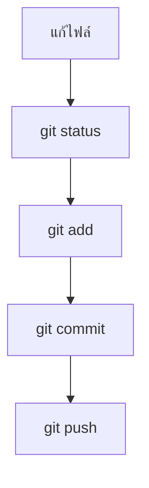

# Issue List and Git

## Day 1 - ชั่วโมงที่ 4: Issue List, Static CRUD View และ Git/GitHub Workflow

### เป้าหมายของชั่วโมงนี้

หลังจบชั่วโมงที่สี่ ผู้เรียนควรสามารถ:

1. สร้างส่วนแสดงรายการปัญหาแบบ static ได้
2. เข้าใจว่า form คือส่วน Create และ list/table คือส่วน Read ของ CRUD
3. ใช้ HTML table หรือ card layout เพื่อแสดงข้อมูลหลายรายการได้
4. ใช้ CSS ตกแต่งรายการข้อมูลให้อ่านง่ายและ scan ได้เร็ว
5. ใช้ Git commands พื้นฐานเพื่อบันทึกงานได้
6. Push project ขึ้น GitHub ได้
7. เขียน README เบื้องต้นเพื่ออธิบายโปรเจกต์ได้

### ไฟล์ที่ใช้ในชั่วโมงนี้

โค้ด table และ status badge อยู่ใน:

```text
index.html
```

CSS ของ table และ badge อยู่ใน:

```text
style.css
```

คำอธิบาย project อยู่ใน:

```text
README.md
```

คำสั่ง Git ให้รันใน terminal ที่ project folder

---

## โครงสร้างเวลา 60 นาที

| เวลา | หัวข้อ | รูปแบบ |
|---|---|---|
| 0-5 นาที | Recap HTML/CSS จากชั่วโมงก่อน | เชื่อมเข้าเนื้อหา |
| 5-15 นาที | จาก Form ไปสู่ CRUD View | Explain |
| 15-30 นาที | สร้างส่วน Issue List ด้วย HTML | Live coding |
| 30-40 นาที | Styling Issue List และ Status Badge | Live coding |
| 40-55 นาที | Git/GitHub workflow | Demo + ทำทีละขั้นตอน |
| 55-60 นาที | Recap และตรวจผลลัพธ์ | สรุป |

---

## Slide 1: Recap จากชั่วโมงที่สาม

### Key Message

ตอนนี้เรามีหน้า form ที่รับข้อมูลได้แล้ว ชั่วโมงนี้เราจะเพิ่มมุมมองของ admin หรือเจ้าหน้าที่ที่ต้องเห็นรายการปัญหาทั้งหมด

---

## Slide 2: วันนี้เราปิด Day 1 ด้วยอะไร

### สิ่งที่จะทำในชั่วโมงนี้

1. เพิ่มส่วนแสดงรายการปัญหาแบบ static
2. ตกแต่ง status badge เช่น OPEN, IN_PROGRESS, DONE
3. สรุปว่า HTML/CSS เชื่อมกับ CRUD อย่างไร
4. ใช้ Git บันทึกงาน
5. Push project ขึ้น GitHub

### Key Message

Day 1 จะจบด้วย static website ที่มีทั้งหน้าแจ้งปัญหาและส่วนดูรายการปัญหา พร้อม source code อยู่บน GitHub

---

## Slide 3: เชื่อมกับ CRUD

### จากชั่วโมงก่อน

เราได้ส่วน Create แล้ว:

```text
Create -> User กรอก form เพื่อแจ้งปัญหาใหม่
```

### ชั่วโมงนี้

เราจะเพิ่มส่วน Read:

```text
Read -> Admin หรือ user ดูรายการปัญหาที่ถูกแจ้งเข้ามา
```

### CRUD เต็มระบบในอนาคต

| Action | ตอนนี้ทำอะไร | วันถัดไปจะต่อยอดเป็นอะไร |
|---|---|---|
| Create | HTML form | บันทึกลง database |
| Read | Static issue list | Query จาก database |
| Update | ยังเป็น mock | เปลี่ยนสถานะจริง |
| Delete | ยังเป็น mock | ลบหรือปิดรายการจริง |

---

## Slide 4: Issue List ควรแสดงข้อมูลอะไร

### ข้อมูลที่ควรเห็นในรายการ

- รหัสรายการ
- หัวข้อปัญหา
- ชื่อผู้แจ้ง
- สถานะ
- วันที่แจ้ง
- สถานะล่าสุด

### ตัวอย่างข้อมูล

| ID | Title | Reporter | Reported At | Status |
|---|---|---|---|---|
| 001 | Login ไม่ได้ | Anan | 2026-06-01 | OPEN |
| 002 | ส่งแบบฟอร์มไม่ได้ | Mali | 2026-06-02 | IN_PROGRESS |
| 003 | ขอสิทธิ์เข้า dashboard | Kanda | 2026-06-03 | DONE |

### Speaker Notes

ชี้ให้เห็นว่านี่คือข้อมูล mock แต่ในระบบจริงข้อมูลเหล่านี้จะมาจาก database

---

## Slide 5: Table หรือ Card ใช้เมื่อไร

### Table เหมาะเมื่อ

- ต้องดูข้อมูลหลายรายการพร้อมกัน
- ต้องเปรียบเทียบ field หลาย column
- เป็น dashboard หรือ admin view
- ข้อมูลค่อนข้างเป็นระเบียบ

### Card เหมาะเมื่อ

- เปิดบน mobile เป็นหลัก
- ข้อมูลต่อรายการมีรายละเอียดหลายบรรทัด
- ต้องการเน้นแต่ละ item แยกกัน

### คำแนะนำสำหรับวันนี้

ใช้ table ก่อน เพราะเหมาะกับ admin view และสอนให้เห็นข้อมูลแบบ database ได้ง่าย

---

## Slide 6: สร้าง Section สำหรับ Issue List

### HTML

### File

```text
index.html
```

### ตำแหน่งที่วาง

วาง section นี้ใน `<main>` ต่อจาก section ของ form แจ้งปัญหา และก่อน `</main>`

```html
<section aria-labelledby="issue-list-title">
  <h2 id="issue-list-title">รายการปัญหาล่าสุด</h2>
  <p>ตัวอย่างรายการปัญหาที่ถูกแจ้งเข้ามาในระบบ</p>

  <!-- table will be here -->
</section>
```

### จุดสำคัญ

- ใช้ `section` เพื่อแยกเนื้อหาเป็นกลุ่ม
- ใช้ `h2` เป็นหัวข้อของ section
- ใช้ `aria-labelledby` เพื่อช่วย accessibility

---

## Slide 7: HTML Table พื้นฐาน

### File

```text
index.html
```

### ตำแหน่งที่วาง

วาง `<table>...</table>` นี้แทน comment `<!-- table will be here -->` ใน section รายการปัญหาจาก Slide 6

```html
<table>
  <thead>
    <tr>
      <th>รหัส</th>
      <th>หัวข้อ</th>
      <th>ผู้แจ้ง</th>
      <th>สถานะ</th>
    </tr>
  </thead>
  <tbody>
    <tr>
      <td>001</td>
      <td>Login ไม่ได้</td>
      <td>Anan</td>
      <td>OPEN</td>
    </tr>
  </tbody>
</table>
```

### อธิบาย

- `table` คือพื้นที่ตาราง
- `thead` คือหัวตาราง
- `tbody` คือข้อมูลในตาราง
- `tr` คือแถว
- `th` คือหัว column
- `td` คือข้อมูลแต่ละ cell

---

## Slide 8: เพิ่ม Mock Issues ลงในตาราง

### File

```text
index.html
```

### ตำแหน่งที่แก้

ใช้ `<tbody>` ชุดนี้แทน `<tbody>` ตัวอย่างจาก Slide 7 ทั้งก้อน

```html
<tbody>
  <tr>
    <td>#001</td>
    <td>Login เข้าระบบไม่ได้</td>
    <td>Anan</td>
    <td><span class="status status-open">OPEN</span></td>
  </tr>
  <tr>
    <td>#002</td>
    <td>ส่งแบบฟอร์มสมัครไม่ได้</td>
    <td>Mali</td>
    <td><span class="status status-progress">IN_PROGRESS</span></td>
  </tr>
  <tr>
    <td>#003</td>
    <td>ขอสิทธิ์เข้าใช้งาน dashboard</td>
    <td>Kanda</td>
    <td><span class="status status-done">DONE</span></td>
  </tr>
</tbody>
```

### Key Message

ถึงข้อมูลจะยังไม่มาจาก database แต่เรากำลังออกแบบหน้าตาของข้อมูลที่จะมาจาก database ในอนาคต

---

## Slide 9: ทำให้ Table Responsive ด้วย Wrapper

### ปัญหา

ตารางที่มีหลาย column อาจล้นหน้าจอบนมือถือ

### วิธีแก้เบื้องต้น

ครอบ table ด้วย container ที่ scroll แนวนอนได้

### File

```text
index.html
```

### ตำแหน่งที่แก้

ครอบ `<table>...</table>` เดิมด้วย `<div class="table-wrapper">...</div>` โดยยังอยู่ใน section รายการปัญหาเดิม

```html
<div class="table-wrapper">
  <table>
    <!-- table content -->
  </table>
</div>
```

### CSS

### File

```text
style.css
```

### ตำแหน่งที่วาง

วางต่อท้ายไฟล์ `style.css` หรือวางใกล้กับ CSS ของ table

```css
.table-wrapper {
  overflow-x: auto;
}
```

### Speaker Notes

นี่เป็นวิธีง่ายและปลอดภัยสำหรับ admin table ในช่วงเริ่มต้น ก่อนจะไปออกแบบ mobile card view ที่ซับซ้อนกว่า

---

## Slide 10: Styling Table

### File

```text
style.css
```

### ตำแหน่งที่วาง

วาง CSS ชุดนี้ต่อจาก CSS ของ form ใน `style.css`

```css
.table-wrapper {
  overflow-x: auto;
  margin-top: 16px;
}

table {
  width: 100%;
  border-collapse: collapse;
  min-width: 680px;
}

th,
td {
  border-bottom: 1px solid #e5e7eb;
  padding: 12px;
  text-align: left;
}

th {
  background: #f8fafc;
  color: #475569;
  font-size: 14px;
}
```

### Key Message

ตารางสำหรับงาน admin ควรอ่านง่าย แยกแถวชัด และ scan ข้อมูลได้เร็ว

---

## Slide 11: Status Badge

### ทำไมต้องมี Badge

สถานะเป็นข้อมูลสำคัญที่ผู้ใช้ต้องเห็นเร็ว จึงควรมี style แยกจากข้อความทั่วไป

### Badge วางไว้ตรงไหนใน table

Badge ต้องวางอยู่ใน `<td>` ของ column **สถานะ**

```html
<tr>
  <td>#001</td>
  <td>Login เข้าระบบไม่ได้</td>
  <td>Anan</td>
  <td>
    <span class="status status-open">OPEN</span>
  </td>
</tr>
```

ถ้าเป็นสถานะอื่น ให้เปลี่ยน class ตัวที่สอง:

```html
<td>
  <span class="status status-progress">IN_PROGRESS</span>
</td>

<td>
  <span class="status status-done">DONE</span>
</td>
```

### HTML

```html
<span class="status status-open">OPEN</span>
<span class="status status-progress">IN_PROGRESS</span>
<span class="status status-done">DONE</span>
```

### CSS

### File

```text
style.css
```

### ตำแหน่งที่วาง

วาง `.status` ต่อจาก CSS ของ table เพราะ badge ใช้ใน table cell

```css
.status {
  display: inline-block;
  border-radius: 999px;
  padding: 4px 10px;
  font-size: 12px;
  font-weight: 700;
}
```

---

## Slide 12: Styling Status แต่ละประเภท

### File

```text
style.css
```

### ตำแหน่งที่วาง

วาง CSS ชุดนี้ต่อจาก `.status` ใน Slide 11

```css
.status-open {
  background: #fee2e2;
  color: #991b1b;
}

.status-progress {
  background: #fef3c7;
  color: #92400e;
}

.status-done {
  background: #dcfce7;
  color: #166534;
}
```

### Speaker Notes

ย้ำว่าการใช้สีช่วยให้ scan ง่ายขึ้น แต่ไม่ควรใช้สีอย่างเดียวในการสื่อความหมาย จึงยังต้องมี text เช่น OPEN, IN_PROGRESS, DONE อยู่ด้วย ค่าเหล่านี้จะถูกใช้ต่อใน Day 2 เป็น TypeScript union type:

```ts
type IssueStatus = "OPEN" | "IN_PROGRESS" | "DONE";
```

---

## Slide 13: Footer สำหรับ Static Website

### HTML

### File

```text
index.html
```

### ตำแหน่งที่วาง

วาง `<footer>...</footer>` ต่อจาก `</main>` และก่อน `</body>`

```html
<footer>
  <p>ฝ่ายเทคโนโลยีสารสนเทศ คณะแพทยศาสตร์</p>
  <p>ตัวอย่างสำหรับ Bootcamp Day 1</p>
</footer>
```

### CSS

### File

```text
style.css
```

### ตำแหน่งที่วาง

วางต่อท้าย `style.css`

```css
footer {
  color: #64748b;
  font-size: 14px;
  padding: 24px;
  text-align: center;
}

footer p {
  margin: 4px 0;
}
```

---

## Slide 14: โค้ดสุดท้ายของ Issue List และตรวจผลลัพธ์

### HTML สุดท้ายของ section รายการปัญหา

```html
<section aria-labelledby="issue-list-title">
  <h2 id="issue-list-title">รายการปัญหาล่าสุด</h2>
  <p>ตัวอย่างรายการปัญหาที่ถูกแจ้งเข้ามาในระบบ</p>

  <div class="table-wrapper">
    <table>
      <thead>
        <tr>
          <th>รหัส</th>
          <th>หัวข้อ</th>
          <th>ผู้แจ้ง</th>
          <th>สถานะ</th>
        </tr>
      </thead>
      <tbody>
        <tr>
          <td>#001</td>
          <td>Login เข้าระบบไม่ได้</td>
          <td>Anan</td>
          <td><span class="status status-open">OPEN</span></td>
        </tr>
      </tbody>
    </table>
  </div>
</section>
```

### CSS สำคัญที่ต้องมี

```css
.table-wrapper {
  overflow-x: auto;
}

.status {
  display: inline-block;
  border-radius: 999px;
  padding: 4px 10px;
  font-size: 12px;
  font-weight: 700;
}
```

### ตอนนี้หน้าเว็บควรมี

- Header
- คำอธิบายระบบ
- Form แจ้งปัญหา
- Section รายการปัญหาล่าสุด
- Table แสดง mock issues
- Status badge
- Footer
- CSS layout
- Responsive behavior เบื้องต้น

### Key Message

นี่คือ prototype ของ web application แม้ยังไม่มี backend และ database

---

## Slide 15: ทำไมต้องใช้ Git

### ปัญหาถ้าไม่มี Git

- ไม่รู้ว่าแก้ไฟล์อะไรไปบ้าง
- ย้อนกลับ version ก่อนหน้าได้ยาก
- ทำงานร่วมกับคนอื่นลำบาก
- ส่งงานให้คนอื่น review ยาก
- ไม่รู้ว่า feature ไหนเปลี่ยนเมื่อไร

### Git ช่วยอะไร

- บันทึกประวัติการเปลี่ยนแปลง
- แยก branch สำหรับ feature ได้
- ทำงานร่วมกันได้
- ใช้คู่กับ GitHub เพื่อเก็บ code online

### Key Message

Git คือเครื่องมือจัดการประวัติของ source code ส่วน GitHub คือพื้นที่เก็บและทำงานร่วมกันบน cloud

---

## Slide 16: Git vs GitHub

| คำ | ความหมาย |
|---|---|
| Git | โปรแกรมจัดการ version control บนเครื่องเรา |
| GitHub | เว็บไซต์สำหรับเก็บ Git repository และทำงานร่วมกัน |
| Repository | โฟลเดอร์ project ที่ Git ติดตาม |
| Commit | จุดบันทึกการเปลี่ยนแปลง |
| Push | ส่ง commit จากเครื่องเราไป GitHub |
| Pull | ดึง commit จาก GitHub ลงเครื่องเรา |

### Speaker Notes

อธิบายให้ชัดว่า Git กับ GitHub ไม่ใช่สิ่งเดียวกัน คล้าย ๆ Git เป็นเครื่องมือ ส่วน GitHub เป็น service ที่ใช้ร่วมกับ Git

---

## Slide 17: Git Workflow พื้นฐาน



### คำสั่ง

```bash
git status
git add .
git commit -m "Create day 1 static issue report page"
git push
```

### Key Message

จำ workflow ให้ได้ก่อน รายละเอียดลึก ๆ ของ Git ค่อยเรียนเพิ่มภายหลัง

---

## Slide 18: เริ่ม Repository ใหม่

### กรณียังไม่มี Git ใน project

```bash
git init
git status
git add .
git commit -m "Initial static issue report page"
```

### ถ้ามี GitHub repo แล้ว

```bash
git remote add origin https://github.com/username/repository-name.git
git branch -M main
git push -u origin main
```

### Speaker Notes

พาไล่ทีละคำสั่ง และชี้ปัญหาที่พบบ่อย เช่น ยังไม่ได้ login GitHub, remote URL ผิด, หรือยังไม่มี commit

---

## Slide 19: Commit Message ที่ดี

### Commit message ที่อ่านรู้เรื่อง

```text
Create issue report form
Style issue form layout
Add static issue list table
Add status badge styles
Update README with project overview
```

### Commit message ที่ควรหลีกเลี่ยง

```text
update
fix
test
asdf
final
final2
```

### Key Message

Commit message คือบันทึกให้ตัวเราเองและทีมในอนาคตเข้าใจว่าเราเปลี่ยนอะไร

---

## Slide 20: README คืออะไร

### README ใช้บอกอะไร

- Project นี้คืออะไร
- ใช้เทคโนโลยีอะไร
- วิธีเปิด project
- โครงสร้างไฟล์
- สิ่งที่ทำเสร็จแล้ว
- สิ่งที่จะต่อยอด

### README สำหรับ Day 1

```md
# IT Issue Report Static Page

โปรเจกต์ตัวอย่างสำหรับ Bootcamp Day 1

## Features

- หน้า form แจ้งปัญหา IT
- รายการปัญหาตัวอย่าง
- Responsive layout เบื้องต้น
- HTML semantic structure
- CSS form styling

## Files

- `index.html`
- `style.css`
```

---

## Slide 21: Push งานขึ้น GitHub

### ขั้นตอน

1. ตรวจไฟล์ `index.html`
2. ตรวจไฟล์ `style.css`
3. สร้างหรือแก้ `README.md`
4. ใช้ `git status`
5. ใช้ `git add .`
6. ใช้ `git commit`
7. สร้าง GitHub repository
8. Push งานขึ้น GitHub

### ผลลัพธ์

ผู้เรียนแต่ละคนควรมี GitHub repository ที่เปิดดู code ได้

---

## Slide 22: Common Git Problems

### ปัญหาที่พบบ่อย

- ยังไม่ได้ `git init`
- ลืม `git add`
- commit ไม่ได้เพราะยังไม่ได้ตั้งค่า user name/email
- remote URL ผิด
- push ไม่ได้เพราะยังไม่ได้ login GitHub
- repository บน GitHub มีไฟล์อยู่ก่อนแล้ว
- อยู่ผิด folder ตอนรันคำสั่ง

### คำสั่งช่วยตรวจ

```bash
git status
git remote -v
git log --oneline
```

### Speaker Notes

ใน Windows ผู้เรียนอาจใช้ PowerShell, Git Bash หรือ terminal ใน VS Code ได้ ให้เลือกทางเดียวในห้องเพื่อไม่ให้สับสน

---

## Slide 23: Day 1 Review

### วันนี้เราเรียนอะไร

- เว็บไซต์หนึ่งระบบทำงานอย่างไร
- Frontend, backend, database คืออะไร
- Request/response คืออะไร
- CRUD คืออะไร
- HTML document structure
- Semantic HTML
- HTML form
- CSS selector
- Box model
- Form styling
- Responsive layout
- Static issue list
- Git/GitHub workflow

### Key Message

วันนี้เราสร้างหน้าเว็บ static แต่เราออกแบบมันให้พร้อมต่อยอดเป็น web application จริงในวันถัดไป โดยโครงสร้าง HTML, ชื่อ form field, class CSS และ status value จะถูกนำไปใช้ต่อใน Next.js

---

## Slide 24: Recap ชั่วโมงที่สี่

### สิ่งที่ได้เรียน

- Static issue list คือ Read side ของ CRUD
- Table เหมาะกับ admin view ที่ต้องดูข้อมูลหลายรายการ
- Status badge ช่วยให้ scan สถานะได้เร็วขึ้น
- Git ใช้บันทึกประวัติ code
- GitHub ใช้เก็บ repository และทำงานร่วมกัน
- README ช่วยอธิบาย project ให้คนอื่นเข้าใจ

### ต่อไปใน Day 2

เราจะย้าย static prototype นี้เข้า Next.js ตามลำดับ:

```text
Hour 1: สร้าง Next.js project
Hour 2: ย้าย HTML/CSS จาก Day 1 เข้า page.tsx และ globals.css
Hour 3: เปลี่ยน static table เป็น TypeScript data model และ issues.map()
Hour 4: แยก component และสร้าง route เช่น /issues, /issues/new, /issues/[id]
```

---


---

## คำศัพท์สำคัญ

| คำศัพท์ | ความหมาย |
|---|---|
| Table | element สำหรับแสดงข้อมูลแบบตาราง |
| `thead` | ส่วนหัวของตาราง |
| `tbody` | ส่วนข้อมูลของตาราง |
| `tr` | แถวของตาราง |
| `th` | หัว column |
| `td` | cell ข้อมูล |
| Badge | ป้ายสถานะหรือ label ขนาดเล็ก |
| Git | เครื่องมือ version control |
| GitHub | service สำหรับเก็บ repository online |
| Repository | project ที่ Git ติดตาม |
| Commit | จุดบันทึกการเปลี่ยนแปลง |
| Push | ส่ง commit ขึ้น remote repository |
| README | ไฟล์อธิบาย project |
