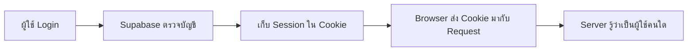

# Auth Flow and Supabase SSR

## Day 5 - ชั่วโมงที่ 1: เตรียมระบบให้รู้จักผู้ใช้

ชั่วโมงนี้เราจะทำความเข้าใจพื้นฐานของ Auth และเตรียม Supabase Server Client ให้พร้อมอ่าน Session ของผู้ใช้

```text
lib/supabase/server.ts   แทนทั้งไฟล์
lib/supabase/proxy.ts    สร้างใหม่
lib/issues.ts            แก้บางส่วน
proxy.ts                 สร้างใหม่ที่ Project Root
```

---

## Slide 1: จากระบบทดลองสู่ระบบที่มีผู้ใช้

หลังจบ Day 4 ระบบของเราทำงานกับ Supabase ได้แล้ว:

- อ่านรายการและรายละเอียดของ Issue
- สร้าง Issue ใหม่
- เปลี่ยนสถานะของ Issue
- Deploy แอปขึ้น Vercel

แต่ Demo Policy ยังอนุญาตให้คนที่ไม่ได้ Login อ่าน สร้าง และแก้ข้อมูลได้

<LessonCallout type="review">

Day 5 จะทำให้ระบบรู้ว่า **ใครกำลังใช้งาน** และ **ผู้ใช้คนนั้นได้รับอนุญาตให้ทำอะไร**

</LessonCallout>

---

## Slide 2: Authentication ต่างจาก Authorization อย่างไร

สองคำนี้ทำงานต่อกัน แต่ตอบคนละคำถาม

| ขั้นตอน | คำถาม | ตัวอย่าง |
|---|---|---|
| Authentication | ผู้ใช้คือใคร | ตรวจ Email และ Password ตอน Login |
| Authorization | ผู้ใช้ทำอะไรได้ | USER สร้าง Issue ได้ ส่วน ADMIN เปลี่ยนสถานะได้ |

```text
Login สำเร็จ → รู้ว่าเป็นใคร → ตรวจว่ามีสิทธิ์ทำอะไร
```

<LessonCallout type="concept">

Authentication คือการ **ตรวจตัวตน** ส่วน Authorization คือการ **ตรวจสิทธิ์** หลังจากรู้ตัวตนแล้ว

</LessonCallout>

---

## Slide 3: Login แล้วระบบจำผู้ใช้ได้อย่างไร

เมื่อ Login สำเร็จ Supabase จะสร้าง **Session** เพื่อจำว่าผู้ใช้คนนี้เข้าสู่ระบบแล้ว



- **Session** คือสถานะที่บอกว่าผู้ใช้กำลัง Login อยู่
- **Cookie** ช่วยเก็บและส่ง Session ระหว่าง Browser กับ Server

ตอนนี้ให้เข้าใจเพียงว่า Cookie ช่วยให้ผู้ใช้ไม่ต้องกรอก Password ใหม่ทุกครั้งที่เปิดหน้า

---

## Slide 4: `@supabase/ssr` คืออะไร

`@supabase/ssr` คือ Package ที่ช่วยให้ Supabase Auth ทำงานกับ Framework ที่มี Code ฝั่ง Server เช่น Next.js

Client จาก Day 4 เชื่อมต่อ Database ได้ แต่ยังไม่ได้อ่าน Session จาก Cookie ของแต่ละ Request

เมื่อติดตั้ง `@supabase/ssr` Server Client จะสามารถ:

- อ่าน Session จาก Cookie
- ส่ง Query ในตัวตนของผู้ใช้ที่ Login
- ทำงานร่วมกับ Proxy เพื่อรักษา Session ให้ต่อเนื่อง

<LessonCallout type="concept">

เป้าหมายคือทำให้ Server รู้ว่า Query แต่ละครั้งกำลังทำงานในสิทธิ์ของผู้ใช้คนใด

</LessonCallout>

---

## Slide 5: เตรียมโปรเจกต์สำหรับ Supabase SSR

<LessonCallout type="action">

เปิด Terminal ที่ Project Root แล้วติดตั้ง Package ที่เพิ่มเข้ามา

</LessonCallout>

```bash
npm install @supabase/ssr
```

โปรเจกต์มี `@supabase/supabase-js` จาก Day 4 อยู่แล้ว จึงไม่ต้องติดตั้งซ้ำ

จากนั้นตรวจ `.env.local` ว่ายังมีค่าชุดเดิม:

```env
NEXT_PUBLIC_SUPABASE_URL=https://your-project.supabase.co
NEXT_PUBLIC_SUPABASE_PUBLISHABLE_KEY=your-publishable-key
```

ถ้าแก้ `.env.local` ให้ Restart Dev Server หนึ่งครั้ง

---

## Slide 6: เปลี่ยน Server Client ให้ใช้ Cookie

Server Client เดิมเชื่อม Database ได้ แต่ยังไม่รู้ว่า Request มาจากผู้ใช้คนใด เราจะเปลี่ยนให้มันอ่าน Cookie ของ Request ได้

<LessonCallout type="action">

ใช้ Code นี้ **แทนเนื้อหาทั้งไฟล์** `lib/supabase/server.ts`

</LessonCallout>

```ts
import { createServerClient } from "@supabase/ssr";
import { cookies } from "next/headers";

export async function createClient() {
  const cookieStore = await cookies();

  return createServerClient(
    process.env.NEXT_PUBLIC_SUPABASE_URL!,
    process.env.NEXT_PUBLIC_SUPABASE_PUBLISHABLE_KEY!,
    {
      cookies: {
        getAll() {
          return cookieStore.getAll();
        },
        setAll(cookiesToSet, _headers) {
          try {
            cookiesToSet.forEach(({ name, value, options }) =>
              cookieStore.set(name, value, options)
            );
          } catch {
            // Server Component เขียน Cookie ไม่ได้ระหว่าง Render
            // Proxy จะเป็นผู้บันทึก Cookie ที่ Refresh แล้วแทน
          }
        },
      },
    }
  );
}
```

จุดสำคัญคือ `getAll()` อ่าน Cookie และ `createClient()` เปลี่ยนเป็น Function แบบ `async` ส่วน `catch` รองรับกรณีที่ Server Component เขียน Cookie ไม่ได้ โดย Proxy จะดูแลงานนี้แทน

---

## Slide 7: ปรับ `lib/issues.ts` ให้รอ Client

เมื่อ `createClient()` เป็น `async` ผู้เรียกต้องใช้ `await` ก่อนจึงจะได้ Supabase Client กลับมา

<LessonCallout type="action">

แก้ Import หนึ่งจุด แล้วค้นหาการสร้าง Client ภายในทั้ง 4 Functions ของ `lib/issues.ts`

</LessonCallout>

<CodeChange code='import { createSupabaseServerClient } from "./supabase/server";\nimport { createClient } from "@/lib/supabase/server";\n\nconst supabase = createSupabaseServerClient();\nconst supabase = await createClient();' removedLines="1,4" addedLines="2,5" />

ต้องแก้ให้ครบใน:

- `getIssues()`
- `getIssueById()`
- `createIssue()`
- `updateIssueStatus()`

<LessonCallout type="check">

ค้นหา `const supabase = createClient()` ถ้ายังพบอยู่ แสดงว่ายังเติม `await` ไม่ครบ

</LessonCallout>

---

## Slide 8: Proxy ช่วยรักษา Session

Session มีอายุจำกัด เมื่อใกล้หมดอายุ Supabase ต้อง Refresh Session และส่ง Cookie ชุดใหม่กลับไปที่ Browser

```text
Request → Proxy ตรวจ Session → Page หรือ Server Action
```

Proxy ทำหน้าที่หลักสามอย่าง:

1. อ่าน Session จาก Cookie
2. Refresh Session เมื่อจำเป็น
3. ส่ง Cookie ชุดใหม่กลับไปเก็บใน Browser

<LessonCallout type="concept">

ให้มอง Proxy เป็นผู้ช่วยดูแล Session ก่อน Request ไปถึงหน้าเว็บ ส่วนการตรวจสิทธิ์จะทำใน Page, Server Action และ RLS ในบทถัดไป

</LessonCallout>

---

## Slide 9: สร้าง Session Helper

ไฟล์นี้เป็น Setup Code สำหรับเชื่อม Supabase Auth กับ Next.js Proxy ไม่จำเป็นต้องจำทุกบรรทัด ให้เข้าใจว่าหน้าที่หลักคืออ่าน ตรวจ และอัปเดต Session

<LessonCallout type="action">

สร้างไฟล์ใหม่ `lib/supabase/proxy.ts` แล้วใช้ Code นี้เป็นเนื้อหาทั้งไฟล์

</LessonCallout>

```ts
import { createServerClient } from "@supabase/ssr";
import { NextResponse, type NextRequest } from "next/server";

export async function updateSession(request: NextRequest) {
  let response = NextResponse.next({ request });

  const supabase = createServerClient(
    process.env.NEXT_PUBLIC_SUPABASE_URL!,
    process.env.NEXT_PUBLIC_SUPABASE_PUBLISHABLE_KEY!,
    {
      cookies: {
        getAll() {
          return request.cookies.getAll();
        },
        setAll(cookiesToSet, headers) {
          cookiesToSet.forEach(({ name, value }) =>
            request.cookies.set(name, value)
          );

          response = NextResponse.next({ request });

          cookiesToSet.forEach(({ name, value, options }) =>
            response.cookies.set(name, value, options)
          );

          Object.entries(headers).forEach(([key, value]) =>
            response.headers.set(key, value)
          );
        },
      },
    }
  );

  await supabase.auth.getClaims();

  return response;
}
```

จำเพียงสามจุด: `getAll()` อ่าน Cookie, `getClaims()` ตรวจและ Refresh Session และ `return response` ส่งผลลัพธ์กลับไปให้ Next.js

---

## Slide 10: เปิดใช้งาน Helper ด้วย Root Proxy

ไฟล์ Helper จะยังไม่ทำงานจนกว่า Next.js จะเรียกผ่านไฟล์ `proxy.ts`

<LessonCallout type="action">

สร้างไฟล์ใหม่ `proxy.ts` ที่ Project Root ระดับเดียวกับ `app/` และ `package.json`

</LessonCallout>

```ts
import { type NextRequest } from "next/server";
import { updateSession } from "@/lib/supabase/proxy";

export async function proxy(request: NextRequest) {
  return await updateSession(request);
}

export const config = {
  matcher: [
    "/((?!_next/static|_next/image|favicon.ico|.*\\.(?:svg|png|jpg|jpeg|gif|webp)$).*)",
  ],
};
```

- `proxy()` ส่ง Request ไปให้ `updateSession()`
- `matcher` ให้ Proxy ทำงานกับหน้าเว็บ แต่ข้าม Static Files และรูปภาพ

ไม่จำเป็นต้องจำ Regular Expression ใน `matcher` ให้คัดลอกตามตัวอย่างก่อน

---

## Slide 11: ทดสอบว่า Setup สำเร็จ

<LessonCallout type="check">

Restart Dev Server แล้วตรวจว่า Feature จาก Day 4 ยังทำงานครบ

</LessonCallout>

1. เปิด `/issues` แล้วรายการยังแสดง
2. เปิด `/issues/[id]` แล้วรายละเอียดยังแสดง
3. สร้าง Issue ใหม่และเปลี่ยนสถานะได้
4. Refresh หน้าแล้ว Terminal ไม่มี Error

ถ้าพบ Error ให้ตรวจตามข้อความ:

| Error | วิธีแก้ |
|---|---|
| หา `@supabase/ssr` ไม่พบ | รันคำสั่งติดตั้งใน Slide 5 |
| หา `createSupabaseServerClient` ไม่พบ | เปลี่ยน Import เป็น `createClient` |
| `.from()` ไม่มีใน `Promise` | เติม `await createClient()` ให้ครบ 4 จุด |

---

## Slide 12: พร้อมสร้างหน้า Login แล้ว

หลังจบ Hour 1 โปรเจกต์มี:

- Server Client ที่อ่าน Session จาก Cookie
- Proxy ที่ตรวจและ Refresh Session
- Database Functions ที่รอ `createClient()` อย่างถูกต้อง

Hour 1 **ยังไม่มีหน้า Login** และยังใช้ Demo Policy เดิม จุดสำคัญคือเราเตรียมระบบให้พร้อมจดจำผู้ใช้ก่อน

<LessonCallout type="review">

Hour 2 จะสร้าง Login, Logout และป้องกันหน้า `/issues/new`

</LessonCallout>

---

## อ้างอิง

- [Supabase: Creating a client for SSR](https://supabase.com/docs/guides/auth/server-side/creating-a-client?framework=nextjs)
- [Supabase: Next.js Auth setup](https://supabase.com/docs/guides/ai-tools/ai-prompts/nextjs-supabase-auth)
- [Next.js: Proxy](https://nextjs.org/docs/app/getting-started/proxy)
