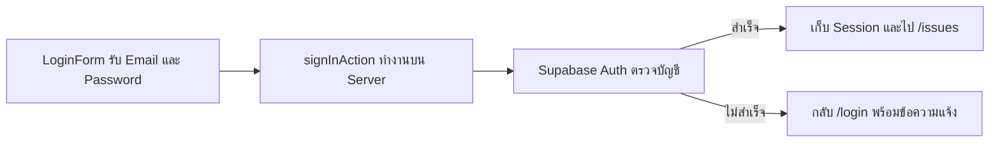

# Login, Logout, and Protected Pages

## Day 5 - ชั่วโมงที่ 2: Login และป้องกันส่วนที่ต้องมีผู้ใช้

ชั่วโมงนี้เราจะนำ Supabase SSR จาก Hour 1 มาใช้ Login จริง แล้วตรวจ Session ก่อนเปิดหน้าและเรียก Server Action ที่ต้องป้องกัน

```text
app/actions.ts             เพิ่ม Login และ Logout
components/LoginForm.tsx   สร้างใหม่
app/login/page.tsx         สร้างใหม่
lib/auth.ts                สร้างใหม่
app/issues/new/page.tsx    แก้บางส่วน
components/AppNav.tsx      สร้างใหม่
app/layout.tsx             แก้บางส่วน
```

---

## Slide 1: จาก Session Setup สู่ Login จริง

Hour 1 เตรียม Server Client และ Proxy ให้ Supabase อ่านและอัปเดต Session Cookie ได้แล้ว แต่ระบบยังไม่มีหน้าสำหรับ Login

Hour นี้เราจะต่อ Flow ให้ครบ:

```text
Login → Supabase ตรวจบัญชี → เก็บ Session → ตรวจผู้ใช้ → ใช้งาน → Logout
```

<LessonCallout type="review">

Session ทำให้ Server รู้ว่าคำขอแต่ละครั้งมาจากผู้ใช้คนใด โดยไม่ต้องส่ง Password ใหม่ทุกหน้า

</LessonCallout>

---

## Slide 2: เตรียมบัญชีสำหรับทดลอง

<LessonCallout type="action">

ไปที่ **Supabase Dashboard → Authentication → Users** แล้วสร้างบัญชีสำหรับทดลอง

</LessonCallout>

```text
user@example.com
admin@example.com
```

- กำหนด Password ที่จำได้สำหรับการทดลอง
- เปิด **Auto Confirm User** หรือตรวจให้ Email เป็น Confirmed
- ทั้งสองบัญชียัง Login ได้เหมือนกัน ส่วน Role `USER` และ `ADMIN` จะเพิ่มใน Hour 3

### ทำไมใช้บัญชีที่เตรียมไว้ล่วงหน้า

Issue Tracker เป็นระบบภายในองค์กร บัญชีผู้ใช้จึงควรถูกสร้างและดูแลโดยผู้ดูแลระบบ ไม่เปิดให้บุคคลทั่วไปสมัครใช้งานเอง

วิธีนี้ยังช่วยให้เราโฟกัสเรื่อง Login, Session และสิทธิ์ของ `USER` กับ `ADMIN` ได้โดยไม่ต้องเพิ่มขั้นตอนยืนยัน Email หรืออนุมัติบัญชี

---

## Slide 3: Login Flow แบ่งหน้าที่อย่างไร



- `LoginForm` รับข้อมูลจากผู้ใช้
- `signInAction` ส่งข้อมูลไปตรวจผ่าน Supabase Server Client
- Supabase SSR บันทึก Session ลง Cookie เมื่อ Login สำเร็จ

<LessonCallout type="concept">

Password ถูกส่งไปตรวจใน Server Action และไม่ถูกเก็บไว้ใน State หรือ Table ของ Issue Tracker

</LessonCallout>

---

## Slide 4: เพิ่ม Server Action สำหรับ Login

`signInAction()` รับ `FormData` จากฟอร์ม แล้วใช้ Supabase Auth ตรวจ Email และ Password

<LessonCallout type="action">

เพิ่ม Import และ Function ต่อไปนี้ใน `app/actions.ts` โดยเก็บ Actions เดิมไว้

</LessonCallout>

```ts
import { createClient } from "@/lib/supabase/server";

export async function signInAction(formData: FormData) {
  const email = String(formData.get("email") ?? "").trim();
  const password = String(formData.get("password") ?? "");

  if (!email || !password) {
    redirect("/login?error=invalid-credentials");
  }

  const supabase = await createClient();
  const { error } = await supabase.auth.signInWithPassword({ email, password });

  if (error) {
    console.error("Login failed:", error.message);
    redirect("/login?error=invalid-credentials");
  }

  revalidatePath("/", "layout");
  redirect("/issues");
}
```

`redirect` และ `revalidatePath` มีอยู่ในไฟล์จาก Day 4 แล้ว จึงเพิ่มเฉพาะ Import ของ `createClient` หากยังไม่มี

### ลำดับการทำงาน

1. อ่าน Email และ Password จาก `formData`
2. `signInWithPassword()` ส่งข้อมูลไปให้ Supabase Auth ตรวจสอบ
3. ถ้าข้อมูลไม่ถูกต้อง ให้กลับหน้า Login พร้อม Error
4. ถ้าสำเร็จ ให้รีเฟรช Layout แล้วไปหน้า `/issues`

`revalidatePath("/", "layout")` สั่งให้ Layout อ่าน Session ใหม่ เพื่อให้ Navigation เปลี่ยนตามสถานะ Login

---

## Slide 5: สร้าง Login Form

<LessonCallout type="action">

สร้างไฟล์ใหม่ `components/LoginForm.tsx` แล้วใส่ Code ทั้งไฟล์

</LessonCallout>

```tsx
"use client";

import { useEffect } from "react";
import { signInAction } from "@/app/actions";

type LoginFormProps = {
  showError: boolean;
};

export function LoginForm({ showError }: LoginFormProps) {
  useEffect(() => {
    if (showError) {
      window.history.replaceState(null, "", "/login");
    }
  }, [showError]);

  return (
    <>
      {showError && (
        <p className="mt-4 text-sm font-medium text-red-700">
          อีเมลหรือรหัสผ่านไม่ถูกต้อง
        </p>
      )}

      <form action={signInAction} className="mt-6 grid gap-4">
        <label className="grid gap-2 text-sm font-semibold text-slate-800">
          Email
          <input
            name="email"
            type="email"
            autoComplete="email"
            required
            className="rounded-md border border-slate-300 px-3 py-2"
          />
        </label>

        <label className="grid gap-2 text-sm font-semibold text-slate-800">
          Password
          <input
            name="password"
            type="password"
            autoComplete="current-password"
            required
            className="rounded-md border border-slate-300 px-3 py-2"
          />
        </label>

        <button className="rounded-md bg-teal-700 px-4 py-3 text-sm font-bold text-white">
          เข้าสู่ระบบ
        </button>
      </form>
    </>
  );
}
```

- `action={signInAction}` ส่งค่าจาก Input เป็น `FormData` ไปยัง Server Action
- `showError` บอกว่าต้องแสดงข้อความ Login ไม่สำเร็จหรือไม่
- `replaceState()` ลบ Error ออกจาก URL โดยไม่ Reload หน้า เมื่อ Refresh ครั้งถัดไปข้อความจึงหาย

<LessonCallout type="concept">

ไฟล์นี้ใช้ `"use client"` เพราะ `useEffect()` และ `window.history` ทำงานใน Browser

</LessonCallout>

---

## Slide 6: สร้างหน้า `/login`

<LessonCallout type="action">

สร้างไฟล์ใหม่ `app/login/page.tsx` แล้วใส่ Code ทั้งไฟล์

</LessonCallout>

```tsx
import { LoginForm } from "@/components/LoginForm";

type LoginPageProps = {
  searchParams: Promise<{ error?: string }>;
};

export default async function LoginPage({ searchParams }: LoginPageProps) {
  const { error } = await searchParams;

  return (
    <main className="mx-auto max-w-md px-6 py-12">
      <section className="rounded-lg border border-slate-200 bg-white p-6">
        <h1 className="text-2xl font-bold text-slate-950">เข้าสู่ระบบ</h1>
        <p className="mt-2 text-sm text-slate-600">
          ใช้บัญชีที่เตรียมไว้เพื่อแจ้งและติดตามปัญหา
        </p>

        <LoginForm showError={error === "invalid-credentials"} />
      </section>
    </main>
  );
}
```

`searchParams` อ่านค่าจาก URL เช่น `/login?error=invalid-credentials` ใน Next.js เวอร์ชันนี้ค่านี้เป็น Promise จึงต้องใช้ `await` ก่อน

<LessonCallout type="check">

เปิด `/login` ต้องเห็นช่อง Email, Password และปุ่มเข้าสู่ระบบ แต่ยังไม่ต้องทดสอบ Protected Page

</LessonCallout>

---

## Slide 7: สร้าง Helper สำหรับอ่านผู้ใช้

หลัง Login แล้ว Session อยู่ใน Cookie แต่ Page และ Action ยังต้องตรวจว่า Session นี้เป็นของผู้ใช้คนใด

<LessonCallout type="action">

สร้างไฟล์ใหม่ `lib/auth.ts` แล้วใส่ Code ทั้งไฟล์

</LessonCallout>

```ts
import { redirect } from "next/navigation";
import { createClient } from "@/lib/supabase/server";

export async function getCurrentUser() {
  const supabase = await createClient();
  const { data, error } = await supabase.auth.getUser();

  if (error || !data.user) {
    return null;
  }

  return data.user;
}

export async function requireUser() {
  const user = await getCurrentUser();

  if (!user) {
    redirect("/login");
  }

  return user;
}
```

| Helper | ใช้เมื่อ | ผลลัพธ์เมื่อยังไม่ Login |
|---|---|---|
| `getCurrentUser()` | ต้องการรู้ว่ามีใคร Login อยู่หรือไม่ | คืน `null` |
| `requireUser()` | ส่วนนั้นบังคับว่าต้อง Login | ส่งไป `/login` |

`getUser()` ตรวจ Session กับ Supabase Auth แล้วคืนข้อมูล เช่น `id` และ `email` ของผู้ใช้

---

## Slide 8: ป้องกันทั้ง Page และ Server Action

การป้องกัน Page ทำให้คนที่ยังไม่ Login เปิดฟอร์มไม่ได้ แต่ Server Action ต้องตรวจซ้ำ เพราะอาจถูกเรียกโดยตรงโดยไม่ผ่านหน้าเว็บ

```text
Protected Page   → ป้องกันการเปิดหน้าผ่าน URL
Protected Action → ป้องกันการส่ง Request เข้ามาโดยตรง
```

<LessonCallout type="concept">

การ Redirect หน้า `/issues/new` ป้องกันเฉพาะ Flow บนหน้าจอ แต่ไม่ได้ทำให้ `createIssueAction()` หยุดรับ Request ผู้ใช้ยังสามารถส่ง Request เองผ่าน Script หรือเครื่องมืออื่นได้ ถ้า Action ไม่ตรวจ Session โค้ดเพิ่มข้อมูลก็ยังทำงาน

</LessonCallout>

### จุดที่ 1: แก้ `app/issues/new/page.tsx`

เก็บ JSX เดิมทั้งหมดไว้ แล้วเพิ่ม Import กับ `await requireUser()` ก่อน `return`

<CodeChange code='import { IssueForm } from "@/components/IssueForm";\nimport { requireUser } from "@/lib/auth";\n\nexport default async function NewIssuePage() {\n  await requireUser();\n\n  return (\n    // เก็บ JSX เดิมไว้\n  );\n}' addedLines="2,5" />

### จุดที่ 2: แก้ `createIssueAction()` ใน `app/actions.ts`

เพิ่ม Import แล้วตรวจผู้ใช้เป็นบรรทัดแรกของ Action โดยเก็บ Code Parse, Validate และ Create เดิมไว้

<CodeChange code='import { requireUser } from "@/lib/auth";\n\nexport async function createIssueAction(formData: FormData) {\n  await requireUser();\n\n  const input = parseIssueInput(formData);\n  // เก็บโค้ดเดิมด้านล่างไว้\n}' addedLines="1,4" />

Navigation และ Protected Page ช่วยควบคุมสิ่งที่ผู้ใช้เห็น ส่วน `requireUser()` ใน Action ป้องกันการเขียนข้อมูลที่ฝั่ง Server

---

## Slide 9: เพิ่ม Server Action สำหรับ Logout

Login สร้าง Session ส่วน Logout ยกเลิก Session เพื่อให้ Request ถัดไปไม่ถูกมองว่าเป็นผู้ใช้คนเดิม

<LessonCallout type="action">

เพิ่ม `signOutAction()` ต่อจาก `signInAction()` ใน `app/actions.ts`

</LessonCallout>

```ts
export async function signOutAction() {
  const supabase = await createClient();
  const { error } = await supabase.auth.signOut();

  if (error) {
    redirect("/issues?error=logout-failed");
  }

  revalidatePath("/", "layout");
  redirect("/login");
}
```

1. `signOut()` ยกเลิก Session ปัจจุบัน
2. `revalidatePath()` ให้ Layout อ่านสถานะใหม่
3. `redirect()` พากลับหน้า Login

---

## Slide 10: สร้าง Navigation ตามสถานะ Login

Navigation ใช้ `getCurrentUser()` เพราะต้องแสดงได้ทั้งตอนที่มีและไม่มีผู้ใช้

<LessonCallout type="action">

สร้างไฟล์ใหม่ `components/AppNav.tsx` แล้วใส่ Code ทั้งไฟล์

</LessonCallout>

```tsx
import Link from "next/link";
import { signOutAction } from "@/app/actions";
import { getCurrentUser } from "@/lib/auth";

export async function AppNav() {
  const user = await getCurrentUser();

  return (
    <nav className="flex items-center justify-between border-b px-6 py-3">
      <Link href="/issues" className="font-bold">
        Issue Tracker
      </Link>

      <div className="flex items-center gap-4 text-sm">
        {user ? (
          <>
            <Link href="/issues/new" className="font-semibold">
              New Issue
            </Link>
            <span>{user.email}</span>
            <form action={signOutAction}>
              <button className="font-semibold text-teal-700">
                Logout
              </button>
            </form>
          </>
        ) : (
          <Link href="/login" className="font-semibold text-teal-700">
            Login
          </Link>
        )}
      </div>
    </nav>
  );
}
```

- ถ้ามี `user` จะแสดง New Issue, Email และ Logout
- ถ้าไม่มี `user` จะแสดง Login
- `<form action={signOutAction}>` เรียก Server Action ได้โดยไม่ต้องสร้าง Event Handler

---

## Slide 11: แสดง Navigation ในทุกหน้า

`RootLayout` ครอบทุก Route จึงเป็นตำแหน่งที่เหมาะสำหรับ Navigation ที่ใช้ร่วมกันทั้งระบบ

<LessonCallout type="action">

แก้ `app/layout.tsx` โดยลบ Navigation เดิม แล้วนำ `AppNav` ที่สร้างใน Slide 10 มาแสดงแทน

</LessonCallout>

<CodeChange code='import Link from "next/link";\nimport { AppNav } from "@/components/AppNav";\n\n<html\n  lang="th"\n  className={`${geistSans.variable} ${geistMono.variable} h-full antialiased`}\n>\n  <body className="min-h-full flex flex-col">\n    <nav className="border-b border-slate-200 bg-white" aria-label="เมนูหลัก">\n      <div className="mx-auto flex max-w-5xl flex-wrap gap-2 px-6 py-3">\n        <Link href="/">หน้าแรก</Link>\n        <Link href="/issues">รายการปัญหา</Link>\n        <Link href="/issues/new">แจ้งปัญหาใหม่</Link>\n      </div>\n    </nav>\n    <AppNav />\n    {children}\n  </body>\n</html>' removedLines="1,9,10,11,12,13,14,15" addedLines="2,16" />

- ลบ `import Link from "next/link"` เพราะ Layout ไม่ได้สร้าง Link เองแล้ว
- ลบ `<nav>...</nav>` ชุดเดิมทั้งก้อน เพื่อไม่ให้มี Navigation ซ้ำสองชุด
- เพิ่ม Import ของ `AppNav` และวาง `<AppNav />` ก่อน `{children}`
- เก็บ `<html>`, `<body>`, Font Classes และ `{children}` เดิมไว้

อย่าเรียก `requireUser()` ใน Root Layout เพราะหน้า `/login` ก็ใช้ Layout นี้ หากบังคับ Login ที่ Layout จะทำให้หน้าสาธารณะเปิดไม่ได้

---

## Slide 12: ทดสอบ Authentication Flow

<LessonCallout type="check">

ทดสอบตามลำดับ เพื่อดูการเปลี่ยนสถานะตั้งแต่ยังไม่ Login จนถึง Logout

</LessonCallout>

1. เปิด `/issues/new` ขณะที่ยังไม่ Login → ต้องไป `/login`
2. กรอก Password ผิด → ต้องเห็นข้อความแจ้ง
3. Refresh หน้าอีกครั้ง → ข้อความต้องหาย
4. Login ด้วยบัญชีที่ถูกต้อง → ต้องไป `/issues`
5. Navigation ต้องแสดง New Issue, Email และ Logout
6. เปิด `/issues/new` และสร้าง Issue → ต้องบันทึกได้
7. กด Logout → ต้องกลับ `/login`
8. เปิด `/issues/new` อีกครั้ง → ต้องกลับ `/login`

### ถ้าผลไม่ตรง

| อาการ | จุดที่ควรตรวจ |
|---|---|
| Login ไม่ผ่าน | บัญชี, Password, Confirmed Email และข้อความใน Terminal |
| Login แล้ว Navigation ไม่เปลี่ยน | `revalidatePath("/", "layout")` |
| เปิด `/issues/new` ได้โดยไม่ Login | `await requireUser()` ใน Page |
| ส่งฟอร์มโดยไม่ Login ได้ | `await requireUser()` ใน Server Action |

---

## Slide 13: Authentication Flow พร้อมใช้งาน

```text
Login → Session Cookie → Current User → Protected Page/Action → Logout
```

<LessonCallout type="review">

ระบบรู้แล้วว่า **ผู้ใช้คือใคร** และบังคับให้ Login ก่อนสร้าง Issue แต่ยังไม่ได้แยกว่า USER และ ADMIN ทำอะไรได้บ้าง

</LessonCallout>

Hour 3 จะเพิ่ม `profiles`, Role, เจ้าของ Issue และ RLS เพื่อให้ Database ตรวจ Authorization จริง

---

## อ้างอิงสำหรับผู้สอน

- [Supabase Auth with Next.js](https://supabase.com/docs/guides/auth/quickstarts/nextjs)
- [Supabase signInWithPassword](https://supabase.com/docs/reference/javascript/auth-signinwithpassword)
- [Supabase getUser](https://supabase.com/docs/reference/javascript/auth-getuser)
